# 从零再学一遍图形学

故事要从大约十多年前说起，那时我还在做游戏服务端（C++/Java），有一段时间准备前后端一起做的（Unity3D），断断续续的看了点OpenGL，但后来还是全做后端相关工作。从服务端到大数据，再到各种中间件、存储等。但对于图形学总感觉没有完全整明白，OpenGL那个渲染管线细节到底是咋回事，裁剪到底是在哪个阶段做的，光照计算也是云里雾里……我始终认为，如果给一定的时间，能把一个东西手搓出来那才叫搞懂了那个东西，刚好2025年春节，老婆和娃都回老家了，大多数时候天气也有点冷，光刷视频也没啥意思，那就在家捣鼓点啥吧。

作为一个始终对前端（不仅限于web）有点兴趣，却又永远抽不出时间的后端，那就（不要再找借口了）折腾下前端吧，刚好之前没搞明白的那些图形学的部分，但我只想搞明白图形学里的东西，可不想去折腾GDI/GLUT/GLFW、构建环境……我的目标是**仅用一个画点函数`setPixel(x, y, z, rgba)`手搓各种图形学算法直到一个完整的软渲染3D场景**。刚好前段时间翻了翻MDN（说实话完全是因为MDN在手机浏览器上的显示太完美了），canvas刚好满足这点，那就开干吧。另外，在这个春节，DeepSeek真是刷爆了屏啊，我本来也是打算结合AI来学习看看效果怎样，刚好VSCode也装了文心快码。

写这段话的时候我已经完成了从DDA画线到一个完整软渲染3D场景的所有探索，一路甚是开心，在此仅记录一下这个过程（不追求绝对的正确，更不追求性能）。这个过程中大模型回答了不少我提的傻x问题，文心快码也能给出很强的代码提示，尤其是向量、矩阵运算三角函数等相关的几乎全对。先放一个完整的Demo：

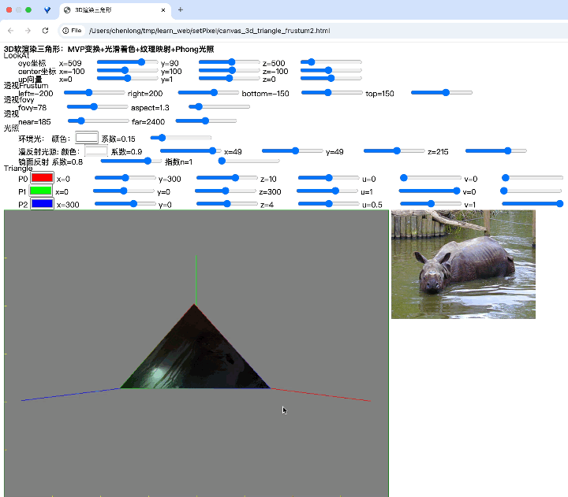


## 先画个直线——DDA

先来搓个最简单的画直线，现在看来还是挺粗糙甚至不完全对，但算个起点吧。上次使用这算法还是MMORPG游戏服务器上战斗系统实现一些能打出直线的技能，得找到人物朝向直线的地图格子，然后找到格子里站的玩家，计算伤害值，扯远了……

在canvas上写DDA还是遇到几个问题：

1. canvas没有画点函数，经过搜索，可用以下代替，这个`setPixel`一直用到贴图，都有卡的感觉才换成后面才知道的`ImageData`。

   ```javascript
   context.fillStyle = "red";
   context.fillRect(x, y, 1, 1);
   ```

2. canvas坐标是左上角(0,0)，而我想用左下角(0,0)。2D图形的变换还是懂的，结合一番搜索，找到办法：

   ```javascript
   context.translate(0, 600);
   context.rotate(Math.PI);
   context.scale(-1, 1);
   ```

   > canvas大小800*600

   这个变换说起来挺简单，但后来我想在顶点上用`context.fillText`把坐标文字也“写”上，发现文字显示全是反的，一番琢磨后发现得先在左上角坐标下“写”文字，再切换到左下角坐标画图。

[canvas_dda.html](canvas_dda.html)

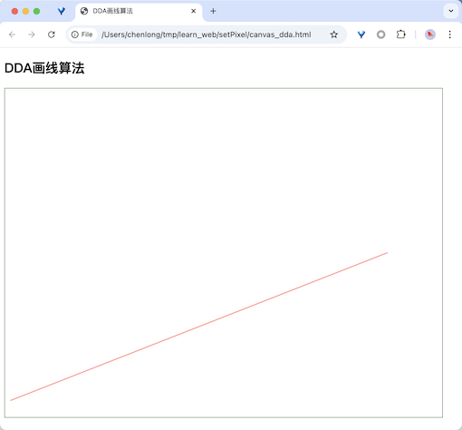


## ttf文件里是什么，文字怎么显示的

之前大概知道字体分为点阵字体和轮廓字体，自从前几年在中国国家博物馆里看了王选查改字模的介绍，我总想把ttf字体文件也拆开来看看里头到底是啥。搜索一番，得知ttf文件可以用FontForge打开来看每个字，然后尝试把字母a导出成文本格式(.eps)，猜测里面lineto是画直线，curveto是画曲线，之前大概知道轮廓字体是贝塞尔曲线（ttf用二次贝塞尔曲线，otf用三次贝塞尔曲线），但eps文件里这是二次还是三次贝塞尔曲线呢？根据lineto和curveto点的个数，琢磨了一阵，估计是三次。然后用canvas自带的画直线和贝塞尔曲线函数把这堆点看能不能画出来一样的字母，果然成了，嗦嘎斯内。

但是之前说好的只用`setPixel`，先挖个坑吧，这里只是想先感受下ttf里存的是啥。

[canvas_font_outline.html](canvas_font_outline.html)

<table border="0">
 <tr>
    <td>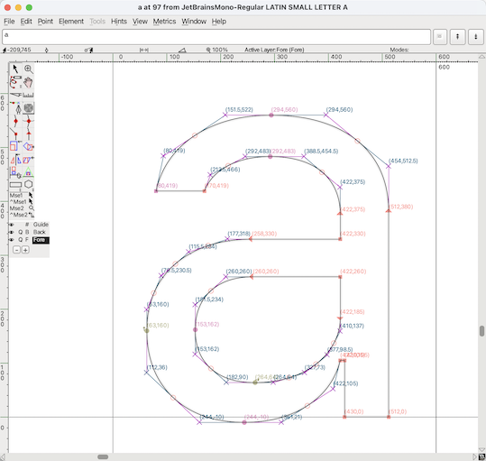</td>
    <td>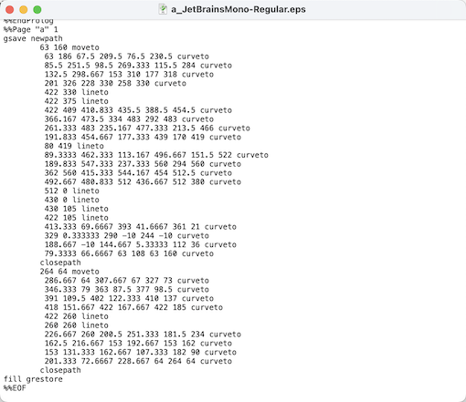</td>
 </tr>
</table>


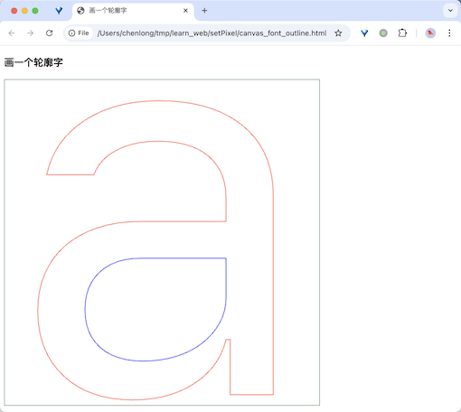


## 画了直线，那也画个曲线吧——Bezier

回来填之前的坑，用`setPixel`画贝塞尔曲线。书上讲参数方程（啥是参数方程？早忘了- -），B站和抖音都是讲几何原理，看的云里雾里，最后还是问豆包搞明白了，这东西说简单也简单，是真的优美。最后画是画出来了，但点与点之间直线连接吗？还是有其他插值算法？继续挖个坑，后面空了搞。

书上的公式都太抽象了，还是豆包给的简单：

三阶贝塞尔曲线有4个控制点 $P_0(x_0,y_0), P_1(x_1,y_1), P_2(x_2,y_2), P_3(x_3,y_3)$ ，参数方程为：

$$
\begin{cases}
x(t)=(1-t)^3x_0+3t(1-t)^2x_1+3t^2(1-t)x_2+t^3x_3 \\\\
y(t)=(1-t)^3y_0+3t(1-t)^2y_1+3t^2(1-t)y_2+t^3y_3
\end{cases}
$$

假如 $t=0.01$ ，然后`for (let i = 0.0; i < 1; i += t) { xt =...; yt = ...;}`计算出来100个点，这100个点连起来就是三阶贝塞尔曲线。

[canvas_bezier.html](canvas_bezier.html)

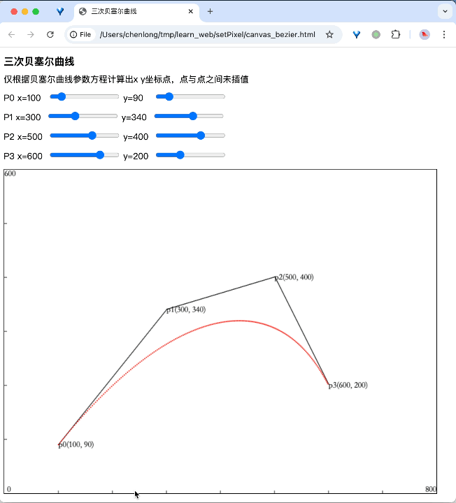


## 利用向量叉乘原理填充三角形

图形学里到处都是向量、矩阵，陆陆续续回顾了下向量、矩阵的运算。突然想到能利用叉乘判断三角形内外，马上实践一下。

向量 $\vec{A}=(x_1, y_1), \vec{B}=(x_2, y_2), 则\vec{A}\times\vec{B}=x_1y_2-y_1x_2$ ，通过 $\vec{A}\times\vec{B}$ 的结果是正数还是负数判断两者的顺时针还是逆时针方向，进而判断三角形内外。

[canvas_triangle_fill](canvas_triangle_fill)

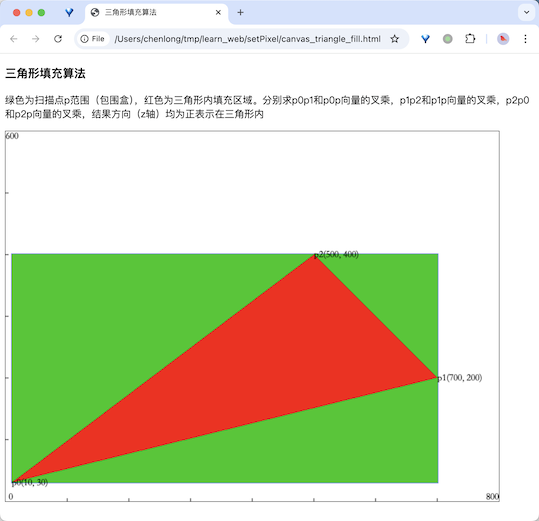


## 2D裁剪算法——Cohen-Sutherland

看书翻到这个裁剪算法，看着挺简单，但写起来还是折腾了一番。

[canvas_cohen_sut.html](canvas_cohen_sut.html)

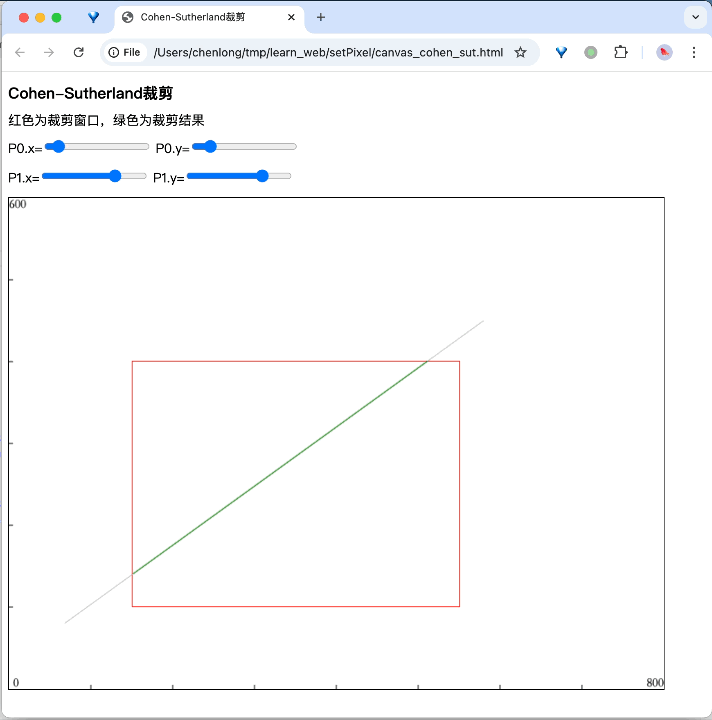


## 封闭多边形内外的判断

某天突然想到公司的地图电子围栏是怎么做的，不就是判断多边形内外嘛。前面那个利用向量叉乘填充三角形的例子估计也可以放到这里，来实践一把试试，果然是可以，但必须是凸多边形，凹多边形用这种算法会出错。然后继续翻书+折磨豆包，原来有个射线算法，搞一发。

[canvas_in_ploygon1.html](canvas_in_ploygon1.html)

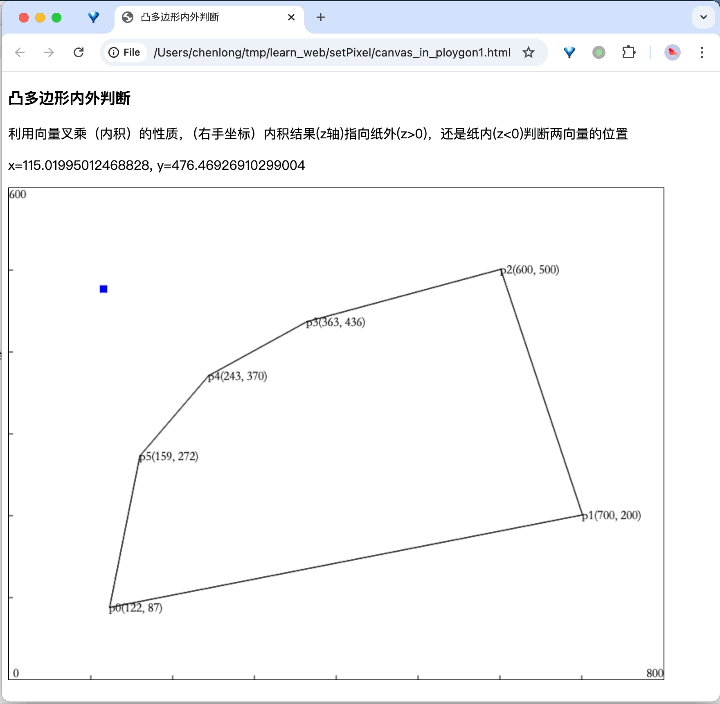

[canvas_in_polygon2.html](canvas_in_polygon2.html)

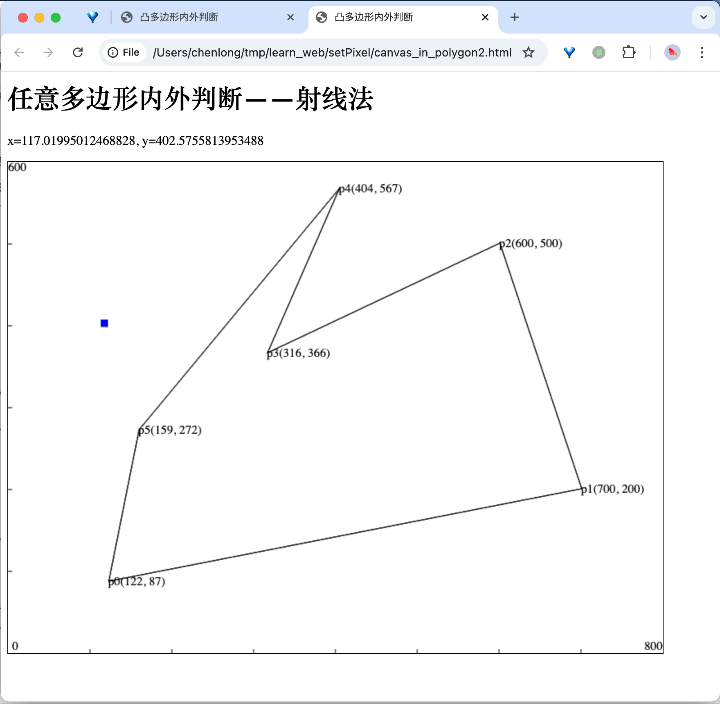


## 三角形内部平滑着色——RGB三角形

前面的例子都是些简单算法，插值是图形学里很重要的一个东西，什么双线性插值，听着有点高端啊，其实就是线性递增或递减嘛…这里三角形三个顶点分别给红色、绿色、蓝色，然后通过双线性插值填充三角形内的颜色。

这里使用向量叉积判断是左三角形还是有三角形，分别求每条扫描线两端和三角形边的交点，然后执行扫描线实现光栅化，过程中利用双线性插值生成三角形内每个点的颜色值。


$$
\begin{flalign}
t_d=\frac{AD}{AB} \\\\\\
D_r=(1-t_d)A_r+t_dB_r \\\\\\
D_g=(1-t_d)A_g+t_dB_g \\\\\\
D_b=(1-t_d)A_b+t_dB_b
\end{flalign}
$$
$$
\begin{flalign}
t_e=\frac{AE}{AC} \\\\\\
E_r=(1-t_e)A_r+t_eC_r \\\\\\
E_g=(1-t_e)A_g+t_eC_g \\\\\\
E_b=(1-t_e)A_b+t_eC_b
\end{flalign}
$$
$$
\begin{flalign}
t_f=\frac{DF}{DE} \\\\\\
F_r=(1-t_f)D_r+t_fE_r \\\\\\
F_g=(1-t_f)D_g+t_fE_g \\\\\\
F_b=(1-t_f)D_b+t_fE_b
\end{flalign}
$$


ps: gif对平滑着色的压缩简直惨不忍睹 - -

[canvas_triangle_color_fill.html](canvas_triangle_color_fill.html)

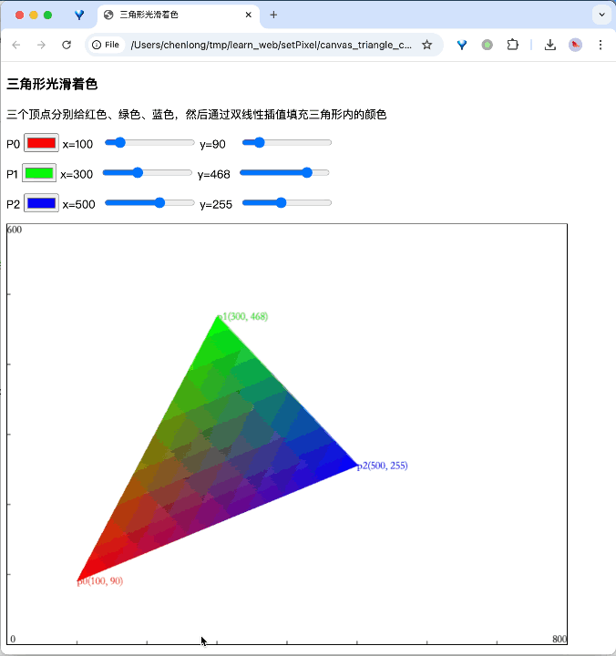


## 光照计算——Phong

颜色有了，那也得有光。这也是我之前没完全整明白的部分，好吧，开始上强度了…重新翻了下书，突然发觉也不是那么复杂。无非是利用单位向量点积算几个 $\cos{\theta}$ 的值嘛。那先来个简化的场景，假如屏幕是XoY平面，然后三维空间有个点光源，模拟一下“环境光照+漫反射光照”的计算。至于镜面反射，额，这个场景还没有视点…

$$
\mathit{I}=\mathit{I_e}+\mathit{I_d}=k_a\mathit{I_a}+k_d\mathit{I_p}max(\vec{N}\cdot\vec{L},0)
$$

$\vec{N}$ 是三角形指向纸外（屏幕外）的单位法向量，两条边的叉积。 $\vec{L}$ 是三角形内的点到点光源的单位向量。再结合前面的光滑着色：

ps: gif对平滑着色+光照的压缩几乎看不了了，三个顶点都调成灰色`rgb(153,153,153)`后勉强能看 - -

<table border="0">
 <tr>
    <td>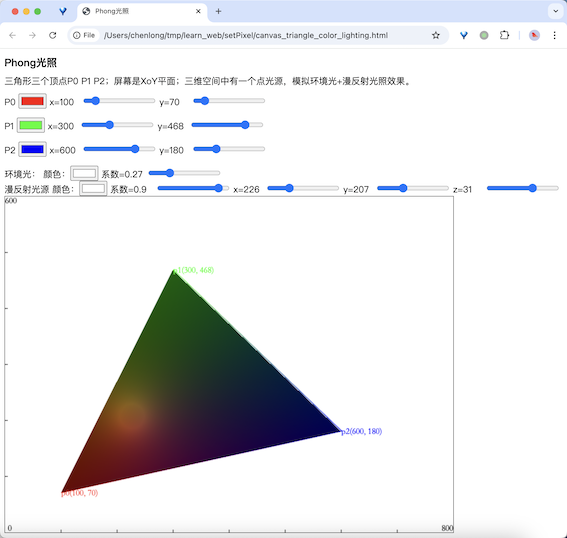</td>
    <td>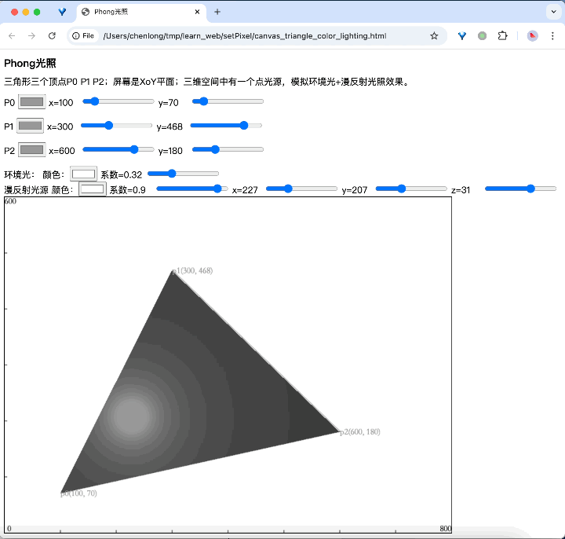</td>
 </tr>
</table>


## 手搓第一个软渲染3D场景，从头实现世界坐标到视图坐标的变换

到目前为止，好像一切都挺顺利，内心膨胀了，我要手搓软渲染一个3D场景！大概原理懂一点，就是MVP变换嘛。我直接在世界坐标里指定三角形的三个顶点，省去了模型变换M。然后也先省去P，也就是不做透视，直接把视图坐标系里的z值扔了往屏幕上画。那就只剩一个视图变换了嘛，好多教程都是讲通过旋转把View坐标系和世界坐标系重叠，这个变换矩阵就是View变换矩阵，包括比较火的GAMES101也这么讲的。那就来一发试试。

参考OpenGL，世界坐标系我用右手系；好像老的固定管线的View坐标系是左手的，那View坐标系我也用左手系。我自己设计了一个旋转规则，**将左手系的View坐标系的+z, +y和右手系的世界坐标系+z, +y重合，将左手系的View坐标系的+x和右手系的世界坐标系-x重合**：

1. 移动View坐标到世界坐标系原点。

$$
   \begin{equation}
   	\begin{bmatrix}
   	 1 & 0 & 0 & -eyeVer[0][0] \\
   	 0 & 1 & 0 & -eyeVer[1][0] \\
   	 0 & 0 & 1 & -eyeVer[2][0] \\
   	 0 & 0 & 0 & 1
   	 \end{bmatrix}
   \end{equation}
$$

2. 按世界坐标y轴旋转，使View坐标系+z旋转到世界坐标YoZ平面

$$
   \begin{equation}
   	\begin{bmatrix}
   	 \cos{\theta} & 0 & \sin{\theta} & 0 \\
   	 0 & 1 & 0 & 0 \\
   	 -\sin{\theta} & 0 & \cos{\theta} & 0 \\
   	 0 & 0 & 0 & 1
   	 \end{bmatrix}
   \end{equation}
$$

3. 按世界坐标x轴旋转，使View坐标系+z和世界坐标系+z重合

$$
   \begin{equation}
   	\begin{bmatrix}
   	 1 & 0 & 0 & 0 \\
   	 0 & \cos{\theta} & -\sin{\theta} & 0 \\
   	 0 & \sin{\theta} & \cos{\theta} & 0 \\
   	 0 & 0 & 0 & 1
   	 \end{bmatrix}
   \end{equation}
$$

4. 最后是按世界坐标的z轴旋转，使View坐标系的+y和世界坐标系+y重合，View坐标系的+x和世界坐标系的-x重合

$$
   \begin{equation}
   	\begin{bmatrix}
   	 \cos{\theta} & -\sin{\theta} & 0 & 0 \\
   	 \sin{\theta} & \cos{\theta} & 0 & 0 \\
   	 0 & 0 & 1 & 0 \\
   	 0 & 0 & 0 & 1 \\
   	 \end{bmatrix}
   \end{equation}
$$

这几步好像都挺简单的，比如第2步，直接用移动后的View坐标系的单位+z向量和世界坐标系的单位+z向量做个点积就得到 $\cos{\theta}$ 了，那根据三角函数 $\sin^2{\theta}+\cos^2{\theta}=1$ 就能算出 $\sin{\theta}$ ，但这里求出来的可能是 $\sin{\theta}$ 也可能是 $-\sin{\theta}$ ，他们分别代表向量是在z轴上面还是下面（如下图红色和蓝色向量）。还有个问题，上面的旋转公式都是逆时针的，还得用三角函数转一下，如下图红色向量和蓝色向量通过向量点积算出来的夹角 $\beta=\frac{3\pi}{4}$ ，绿色和蓝色夹角 $\beta'=\frac{3\pi}{4}$ ，但按照逆时针旋转，红色要旋转 $\theta=\beta=\frac{3\pi}{4}$ ，而绿色要旋转 $\theta'=2\pi-\beta'=2\pi-\frac{3\pi}{4}=\frac{5\pi}{4}$ 。

要判断是红色还是绿色，那么可以使用向量的叉积结果的正负来判断，然后来决定是选择 $\sin{\theta}$ 还是 $-\sin{\theta}$ ，诱导公式：

$$
\begin{array}{l}
\sin({2\pi-\theta})=\sin({2\pi})\cos{\theta}-\cos({2\pi})\sin{\theta}=-\sin{\theta} \\
\cos({2\pi-\theta})=\cos({2\pi})\cos{\theta+\sin({2\pi})sin{\theta}}=\cos\theta
\end{array}
$$

ps: 三角函数忘光了😭

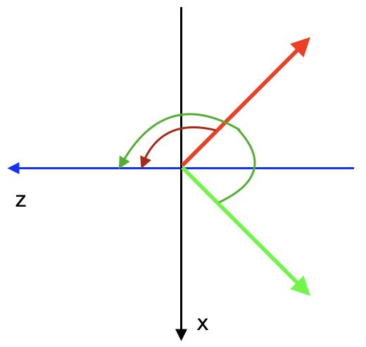

其实一开始还是用立体几何的方法各种算三维空间中的向量模长，进而算 $\cos\ \sin$ 的值，但要判断的各种正负情况太多了。头一天晚上都没搞定，第二天一早才想到上面的用向量点积算 $\cos$ ，再用叉积判断是选择 $\sin{\theta}$ 还是 $-\sin{\theta}$ ，年三十和初一晚上都在比划“小手枪”（叉乘判断方向），好在费了九牛二虎之力画出来了，顺带还把沉睡的三角函数、线性代数的记忆唤醒了一点儿。

另外还有个问题是View到屏幕的转换，也就是OpenGL里的ViewPort变换，这里很暴力，直接把View的z值扔了，然后原点转到屏幕中间：

$$
\begin{bmatrix}
 1 & 0 & 0 & \frac{canvas.width}{2} \\
 0 & 1 & 0 & \frac{canvas.height}{2} \\
 0 & 0 & 1 & 0 \\
 0 & 0 & 0 & 1
 \end{bmatrix}
$$


这个例子也没有考虑深度，也就是zbuffer，下面的图里也看到坐标轴会被三角形覆盖，产生不真实感。但这是我用`setPixel`渲染的第一个3D场景，最终效果是这样的，ps再次吐槽gif的压缩😔

[canvas_3d_triangle.html](canvas_3d_triangle.html)

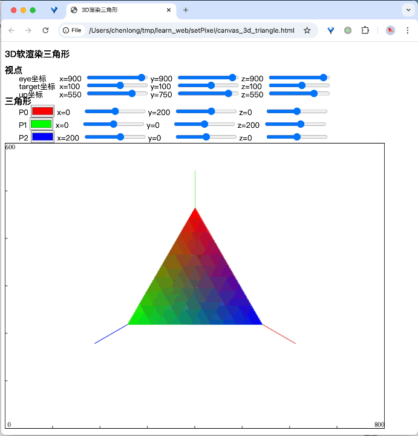


## 把一张图片贴到三角形上——纹理映射

说实话，前一个例子有点烧脑，第二天和爸妈出去耍了一圈缓解一下。有了着色、有了光、也软渲染了3D场景（虽然纯蛮力而且简陋），那就来个纹理吧。

纹理映射说直白点就是贴图嘛，OpenGL（固定管线）里设置几个参数，图就贴到模型上了，但如果只用`setPixel`手搓该怎么做呢？这里先用二维场景模拟，还是屏幕是XoY平面，我们看向-z轴。初步想了下，找到三角形内的每个点和三个点的位置关系，到纹理（图片）上取对应位置的颜色值填到三角形里就行了。几个实现的问题：

1. canvas怎么取图片里每个像素的颜色

   [MDN](https://developer.mozilla.org/en-US/docs/Web/API/Canvas_API/Tutorial/Pixel_manipulation_with_canvas)里有怎么操纵像素的教程，那图片怎么读进来？用``？我想每个文件都是完全字包含的，不依赖于任何外部的资源，搜索一番后发现可以把图片数据base64直接写到代码里，nice。

   ```javascript
   const rhinoPng = 'iVBORw0KGg...';
   let img = new Image();
   img.src = `data:image/png;base64,${rhinoPng}`
   document.body.appendChild(img);
   ```

2. 三角形内的每个点和三个点的位置关系怎么表示。

   一开始想还用前面那个双线性插值填充三角形的算法，仔细一想要排序顶点、要判断是左三角形还是右三角形、要计算每条扫描线和边的交点、要计算3个t值……要处理的细节太多了。问了下豆包，三角形重心，通过 $\alpha\ \beta\ \gamma$ 三个值确定三角形内的一个点的位置，完全不需要前面那么多的步骤，不用排序顶点、不用管是左三角形还是右三角形，为伟大的数学干一杯🍻

   但写的时候出问题了，那 $\alpha\ \beta\ \gamma$ 和顶点的对应关系老搞不对，导致贴的图和顶点的关系不对！豆包和DeepSeek给出了大段的文字描述，问他能不能画个图解释，她说她只是个语言模型画不了图…喵喵喵喵喵😂，最终还是搜索引擎帮解决的，我自己整理了一遍：
   
   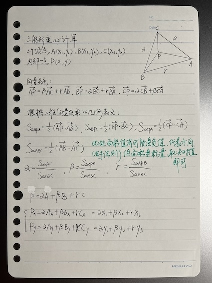


3. 我不想再用`context.fillRect(x, y, 1, 1)`画点了，我想有一片连续的内存（显存）当FrameBuffer，直接在里面填颜色值。

   [MDN](https://developer.mozilla.org/en-US/docs/Web/API/Canvas_API/Tutorial/Pixel_manipulation_with_canvas)里操纵像素的教程给了我灵感，原来js里也有`Uint8ClampedArray`这种东西，能直接开一块连续内存了，作为曾经的C程序员狂喜，给我一个`char[]`和`setPixel`那我不是可以造一个宇宙了嘛😄。把图画在FrameBuffer里，然后一次性丢给canvas显示就行了。

   来吧，写个像样的`setPixel`：

   ```javascript
   // 初始化屏幕缓冲区
   let screen = { };
   screen['width'] = 800;
   screen['height'] = 600;
   screen['frameBuffer'] = new Uint8ClampedArray(4 * screen.width * screen.height);
   screen['setPixel'] = function (x, y, color) {
       // x y原点在左下角，而frameBuffer的原点在左上角，所以要先转换坐标
       let screenX = Math.floor(x), screenY = Math.floor(screen.height - 1 - y);
       let frameBufferIdx = (4 * screen.width * screenY) + (4 * screenX);
       screen.frameBuffer[frameBufferIdx] = color.r;
       screen.frameBuffer[frameBufferIdx + 1] = color.g;
       screen.frameBuffer[frameBufferIdx + 2] = color.b;
       screen.frameBuffer[frameBufferIdx + 3] = color.a;
   };
   screen['reset'] = function() {
       screen.frameBuffer.fill(0, 0);
   };
   ```

4. 用了上面的FrameBuffer后发现一个新问题，原来用`context.fillText()`写文字的方法用不了了。思索一番，初步的想法是找个能解析ttf的js库（opentype.js?我可不想去手动解析ttf），获取文字的字型（glyph）数据（也就是上面那个.eps文件里的内容），然后：

   1. 按字号放缩glyph数据。
   2. 根据写文字的坐标移动glyph数据。
   3. 画轮廓（各种直线、贝塞尔曲线）。
   4. 使用多边形填充算法填充。

   这…是要撸个字体引擎的节奏啊，这个坑有点大😆

最终的成品[canvas_texture1.html](canvas_texture1.html)


## 利用已知的MVP矩阵手搓一个软渲染3D场景，折戟光照计算

搞完上面的贴图，一般图形学里的主要内容（光栅实时渲染部分）好像都沾到点边了，还是继续回来肝软渲染3D！这回老老实实找本书啃一下吧。原来MVP每个矩阵前人都已经准备好了，你只管根据参数生成矩阵用就是了，数学真了不起🍻

世界坐标到眼坐标的转换，也就是OpenGL里的[gluLookAt(eyex, eyey, eyex, centerx, centery, centerz, upx, upy, upz)](https://registry.khronos.org/OpenGL-Refpages/gl2.1/xhtml/gluLookAt.xml)，直接利用前人总结的旋转矩阵：

$$
\begin{bmatrix}
 S_x & S_y & S_z & -\vec{S}\cdot\vec{eye} \\
 U_x & U_y & U_z & -\vec{U}\cdot\vec{eye} \\
 -\vec{F_x} & -\vec{F_y} & -\vec{F_z} & \vec{F}\cdot\vec{eye} \\
 0 & 0 & 0 & 1
 \end{bmatrix}
$$

$$
\vec{F}=normalize(
\begin{bmatrix}
 center_x-eye_x \\
 center_y-eye_y \\
 center_z-eye_z \\
 0
 \end{bmatrix})
$$

$$
\vec{S}=normalize(\vec{F}\times\vec{up})
$$

$$
\vec{U}=\vec{S}\times\vec{F}
$$

看公式还是有点抽象，其实代码就这么几行：

```javascript
// 世界坐标系转换到view坐标系
// https://github.com/g-truc/glm/blob/69b130c162e6266e07392741bd04feacc55dcda2/glm/ext/matrix_transform.inl#L153
// https://learn.microsoft.com/zh-cn/windows/win32/opengl/glulookat
// https://000ddd00dd0d.github.io/2019/04/23/lookAt-function/
function lookAt(eye, center, up) {
    // forward方向，-z轴
    const f = normalize([
        [center[0][0] - eye[0][0]],
        [center[1][0] - eye[1][0]],
        [center[2][0] - eye[2][0]],
        [0.0]
    ]);
    // 右方向，x轴
    const s = normalize(crossProduct(f, up));
    // 上方向，y轴
    const u = crossProduct(s, f);
    return [
        [s[0][0], s[1][0], s[2][0], -dotMultiply(s, eye)],
        [u[0][0], u[1][0], u[2][0], -dotMultiply(u, eye)],
        [-f[0][0], -f[1][0], -f[2][0], dotMultiply(f, eye)],
        [0.0, 0.0, 0.0, 1.0]
    ];
}
```


然后就是透视P了，我通过相似三角形还是能算得出在投影平面的$x\ y\ z$值的，但看书上好像不是那么回事，有什么CVV空间、透视除法、NDC空间…我了个去，这些是啥子啊😂。和豆包和搜索引擎搏斗了半天，大概明白了些。通过相似三角形算投影平面上的坐标，没办法生成统一一个矩阵，而是每个顶点的变换矩阵里的数和该顶点到视点（在View空间其实就是原点）的距离（z）有关，这就很难受了，不能一个矩阵用于所有顶点的变换了。另外，透视投影不是在一个四四方方的立方体里面，而是边是斜的一个平截头体（CVV）里，这对后面的其他操作带来了复杂性，所以科学家们又让其变换到一个正正规规的[-1, -1, -1]到[1, 1, 1]的立方体里面（NDC），当然这里头的东西肯定是变形的，但没关系，转到屏幕上的时候又会再复原。

好吧，这听起来确实有点复杂，里面那个透视除法我感觉也没完全理解通透，所有公式我也没全部手推一遍，挖个坑后面来填吧。好在有[GLM](https://github.com/g-truc/glm)这种成熟的库可作参考，其实就是实现OpenGL里的[glFrustum(left, right, bottom, top, near, far)](https://registry.khronos.org/OpenGL-Refpages/gl2.1/xhtml/glFrustum.xml)或[gluPerspective(fovy, aspect, near, far)](https://registry.khronos.org/OpenGL-Refpages/gl2.1/xhtml/gluPerspective.xml)。这两个函数的数学原理那么复杂，但实现代码简单的令人发指！

```javascript
// view坐标系转换到透视投影坐标系，再转换到cvv坐标系
// https://github.com/g-truc/glm/blob/69b130c162e6266e07392741bd04feacc55dcda2/glm/ext/matrix_clip_space.inl#L165
// https://learn.microsoft.com/zh-cn/windows/win32/opengl/glfrustum
// https://www.cnblogs.com/Tearix/p/7146538.html
function frustum(left, right, bottom, top, near, far) {
    return [
        [2.0 * near / (right - left), 0, (right + left) / (right - left), 0.0],
        [0.0, 2.0 * near / (top - bottom), (top + bottom) / (top - bottom), 0.0],
        [0.0, 0.0, -(far + near) / (far - near), -2.0 * far * near / (far - near)],
        [0.0, 0.0, -1.0, 0.0]
    ];
}

function perspective(fovy, aspect, zNear, zFar) {
    const tanHalfFovy = Math.tan(fovy / 2);
    return [
        [1.0 / (aspect * tanHalfFovy), 0, 0, 0],
        [0, 1 / tanHalfFovy, 0, 0],
        [0, 0, -(zFar + zNear) / (zFar - zNear), -(2 * zFar * zNear) / (zFar - zNear)],
        [0.0, 0.0, -1.0, 0.0]
    ]
}
```

还有一步就是viewport映射，这个其实和之前自己手搓的类似，就是吧坐标原点移到屏幕中心，好让我能看到画出来的图，也就是实现[glViewPort](https://registry.khronos.org/OpenGL-Refpages/gl4/html/glViewport.xhtml)：

```javascript
// ndc坐标系转屏幕坐标系
// https://learn.microsoft.com/zh-cn/windows/win32/opengl/glviewport
function viewport(viewPort) {
    return [
        [viewPort.width / 2.0, 0.0, 0.0, viewPort.x + (viewPort.width / 2.0)],
        [0.0, viewPort.height / 2.0, 0.0, viewPort.y + (viewPort.height / 2.0)],
        [0.0, 0.0, 1.0, 0.0],
        [0.0, 0.0, 0.0, 1.0]
    ];
}
```

整个投影的过程如下：

```javascript
// 世界坐标MVP变换，再viewport变换到屏幕坐标系
// https://github.com/g-truc/glm/blob/69b130c162e6266e07392741bd04feacc55dcda2/glm/ext/matrix_projection.inl#L21
function project(ver, modelMat, viewMat, perspMat, viewPort) {
    let tmp = matrixMul(modelMat, ver);
    tmp = matrixMul(viewMat, tmp);
    tmp = matrixMul(perspMat, tmp);

    // 透视除法，将z坐标归一化到[-1, 1]区间
    tmp = [
        [tmp[0][0] / tmp[3][0]], 
        [tmp[1][0] / tmp[3][0]],
        [tmp[2][0] / tmp[3][0]],
        [1.0]
    ]
    tmp[0] = [tmp[0] * (viewPort.width / 2.0) + viewPort.x + (viewPort.width / 2.0)];
    tmp[1] = [tmp[1] * (viewPort.height / 2.0) + viewPort.y + (viewPort.height / 2.0)];
    return tmp;
}
```


这个例子里也实现了深度信息，也就是zbuffer了，下面图里看得出坐标轴和三角形不会相互错误覆盖了。

最后我还想把纹理和光照也加进去，纹理映射加的比较顺利。但写光照计算那里遇到了新问题，三角形里的点是在最后光栅化的时候通过双线性插值得到的，这个时候已经在二维空间了，而光照计算漫反射部分是要计算三角形里每个点和点光源的向量的，镜面反射也是要计算三角形里每个点和视点的向量的，那二维空间插值出来的三角形里的每个点的z值我哪里找去呢？F*** 这里引申出来一个问题，光照计算到底是在世界坐标还是视图坐标计算的？还是在光栅化阶段做的？如果是在View空间做，那不是要在View空间插值计算三角形里的点的坐标，三维空间插值？也不是不行，但这好像有点烧脑😂。所以我的初步想法是，还是在光栅化阶段做插值，然后再插值找到这个二维点的三维z值，那好像得把每个顶点在View空间的z值带到光栅阶段🤔…

时间已晚，先这么招吧，今天终究是搞不完这个光照了。

最终的成品[canvas_3d_triangle_frustum.html](canvas_3d_triangle_frustum.html)

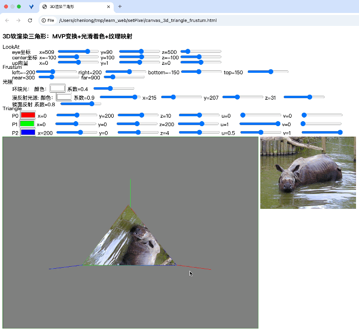


## 再战软渲染3D场景，实现完全体“MVP变换+光滑着色+纹理映射+Phong光照”

第二天我把想法喂给了DeepSeek，光照计算的确是在View空间简单些，但也不是直接从光栅化阶段插值出z值，而是有个叫透视矫正的东西，大概就是说不能直接插值计算 $z$ 值，要有个补偿，而那个补偿是以View空间的z值为参数的一个函数值，这样得到的z值才准确的，甚至 $x\ y$ 也要用这个矫正公式才正确。说实话这点我也没整通透，还没全手工推过这公式，但不妨碍我先用他。

三角形内的每个点的View坐标：

$$
\begin{array}{l}
    P_x=\frac{\alpha\frac{P0_x}{P0_w}+\beta\frac{P1_x}{P1_w}+\gamma\frac{P2_x}{P2_w}}{\frac{\alpha}{P0_w}+\frac{\beta}{P1_w}+\frac{\gamma}{P2_w}} \\
    P_y=\frac{\alpha\frac{P0_y}{P0_w}+\beta\frac{P1_y}{P1_w}+\gamma\frac{P2_y}{P2_w}}{\frac{\alpha}{P0_w}+\frac{\beta}{P1_w}+\frac{\gamma}{P2_w}} \\
    P_z=\frac{\alpha\frac{P0_z}{P0_w}+\beta\frac{P1_z}{P1_w}+\gamma\frac{P2_z}{P2_w}}{\frac{\alpha}{P0_w}+\frac{\beta}{P1_w}+\frac{\gamma}{P2_w}}
\end{array}
$$

$$
\begin{array}{l}
P0_w=-P0_z \\
P1_w=-P1_z \\
P2_w=-P2_z
\end{array}
$$

最后总算补上了光照计算（环境光+漫反射光+镜面反射光），实现了完整的**MVP变换+光滑着色+纹理映射+Phong光照**

成品[canvas_3d_triangle_frustum2.html](canvas_3d_triangle_frustum2.html)


另一个正交投影的例子[canvas_3d_triangle_ortho.html](canvas_3d_triangle_ortho.html)

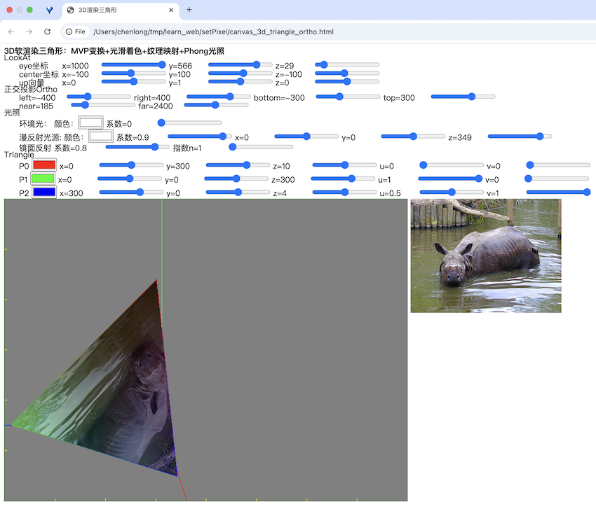


## 完善上面两个3D软渲染的透视矫正

假期的最后两天反复琢磨了下裁剪空间、齐次空间、NDC空间，期间和豆包掰扯了不知道多少遍，算是理解了些，但也不敢说通透。大概意思是齐次空间是一个非线性的四维空间（所以难理解），经过透视除法之后（NDC空间），很多关系都不是线性的了，无法直接在NDC空间做插值等操作，需要用齐次空间的W的倒数做插值。这里面的数学原理我再慢慢琢磨吧。总之这次的旅程再次打开了我对数学的兴趣，尤其那个视锥体变换到长方体的z值的非线性变化，神奇的很啊…

最后把以上两个3D软渲染的例子都加了透视矫正，按我的理解应该是对的了，但也不敢完全确认…


## 使用opentype.js读取ttf字体，或取轮廓并绘制

最后回来填个坑，之前改用FrameBuffer后没办法用`context.fillText`“写”文字了，沿着之前的思路：

1. 用opentype.js加载ttf字体。

   opentype.js只能加载ttf文件，因为我要用中文，所以找到的字体是`Songti.ttc`，ttc是多个ttf文件的集合。用opentype.js读取前需要用工具将其中一个字体导出为ttf。这里用的工具是`fontTools.ttLib`

   1. 安装`fonttools`：`pip3 install fonttools`

   2. 导出脚本getTTF.py

      ```python
      from fontTools.ttLib import TTCollection
      
      # 加载 TTC 文件
      ttc = TTCollection('Songti.ttc')
      
      # 提取第一个字体
      print(len(ttc.fonts))
      font = ttc.fonts[3]
      
      # 保存为 TTF 文件
      font.save('Songti0.ttf')
      ```

   3. 执行getTTY.py得到文件`Songti0.ttf`

   4. 直接使用cdn加载太慢了，下载回来一份，这和上面的字体文件也导致无法直接打开html显示了。需要一个简单的http服务。

      ```shell
      cd setPixel
      python3 -m http.server 7777
      ```

   5. 打开地址http://localhost:7777/canvas_opentypejs.html

2. 或取文字的轮廓数据。

   ```javascript
   const fontPath = 'fonts/Songti0.ttf';
   // const fontPath = 'fonts/unifont-15.0.01.ttf';
   const buffer = fetch(fontPath).then(res => res.arrayBuffer());
   buffer.then(data => {
       const font = opentype.parse(data);
       console.log(font);
       const path = font.getPath('Hello, World! 你好世界！', 0, 150, 72);
       ...
   })
   ```
   
3. 根据轮廓数据“画出来”。

   这里直接使用canvas的画线lineTo、贝塞尔曲线quadraticCurveTo/bezierCurveTo函数。后面有空再全部setPixel吧。

   ```javascript
   ctx.beginPath();
   for (let i = 0; i < path.commands.length; i++) {
       let command = path.commands[i];
       if (command.type === 'M') {
           ctx.moveTo(command.x, command.y);
       } else if (command.type === 'L') {
           ctx.lineTo(command.x, command.y);
       } else if (command.type === 'Q') {
           ctx.quadraticCurveTo(command.x1, command.y1, command.x, command.y);
       } else if (command.type === 'C') {
           ctx.bezierCurveTo(command.x1, command.y1, command.x2, command.y2, command.x, command.y);
       } else {
           console.error("unknown command type: " + command.type);
       }
       ctx.stroke();
   }
   // ctx.fill();
   ctx.closePath();
   ```

   

[canvas_opentypejs.html](canvas_opentypejs.html)

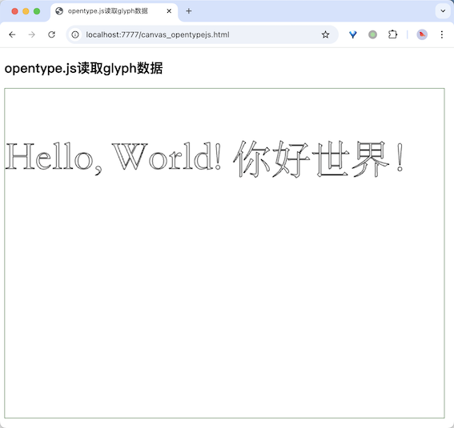
